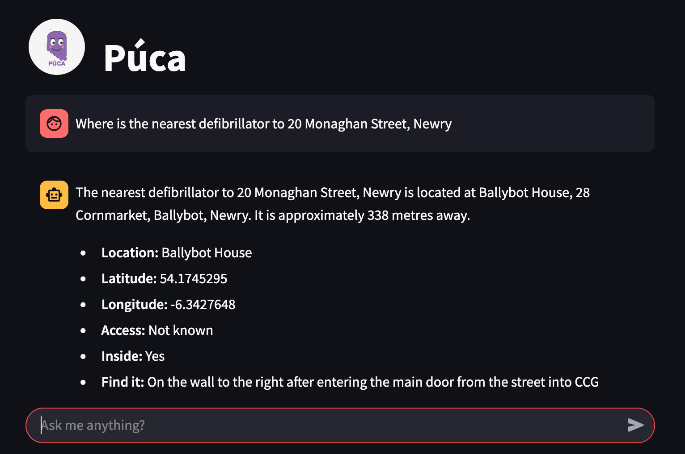

# osm-ui-puca

This repo has the python streamlit UI code for the Púca web interface. The web interface uses OpenAI and the Púca MCP server to provide tools related to OpenStreetMap.

## Usage

This MCP server can be integrated with your client that supports MCP.


### Docker

The `docker-compose.yaml` file included in this repo will run both the púca UI and MCP server so that you can enter queries into the UI.
To do so you will need to add your own OpenAI API Key in the `.env` file then start the containers with:

```
docker compose up -d
```

Check the logs for any issues and visit the web interface at `http://your.ip.address:3301`

### Pydantic AI

See the example file `client.py` for how to use this MCP server with Python's pydantic_ai

### Claude

Anthropic's Claude supports adding MCP servers if you edit the file:

```
vi ~/Library/Application\ Support/Claude/claude_desktop_config.json
```

adding the following but amending the URL:

```
{
    "mcpServers": {
      "puca": {
          "command": "npx",
          "args": [
            "mcp-remote",
            "http://192.168.1.40:3300/sse"
          ]
        }
    }
}
```

## Tools

Below is a list of the tools made available via the MCP server:

- get_coordinates_for_address
- get_address_by_coordinates
- get_defibrillators
- get_distance_between_addresses
- get_distance_between_coords
- get_parking
- get_toilets
- get_post_offices
- get_cafes
- get_fast_food_places
- get_irish_street_names
- get_vacant_buildings
- get_overpass_results

## Acknowledgements

This MCP server makes use of the freely available APIs from OSRM, Overpass and Nominatum.
The data in OpenStreetMap is contributed by volunteers such as myself, so please don't forget to add attributions.
